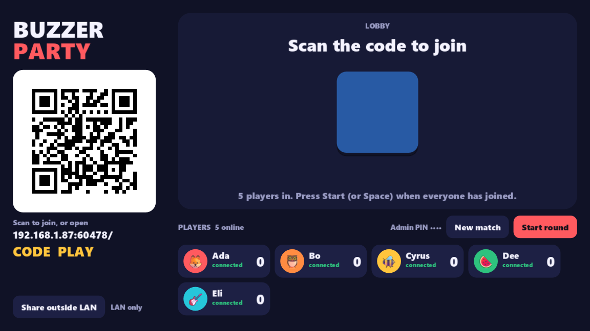
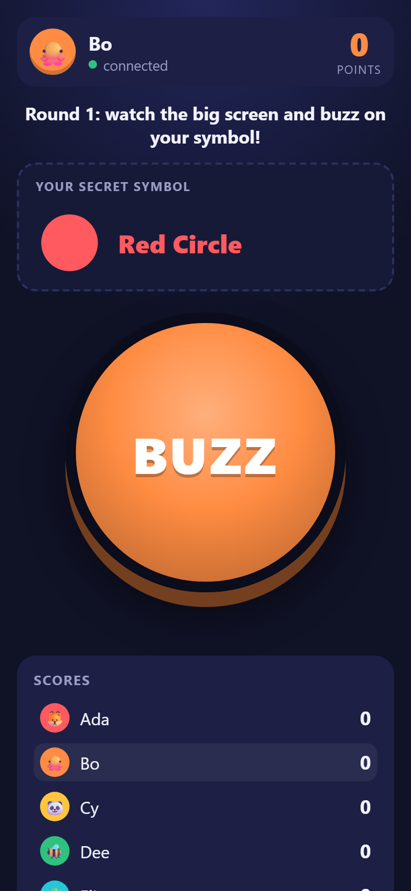

# godot-phone-mass-controllers

Turn a Godot 4 game into the host for a room full of phone controllers. Players scan a QR code,
their phone's browser loads a controller page **served by the game itself**, and they're in. There's no app
to install, no Node, no relay server, and no native binaries. It's pure GDScript.

Inspired by [HappyFunTimes](https://github.com/greggman/HappyFunTimes), rebuilt for Godot with the game as the
authority: the addon handles transport, identity and rejoin, the join QR, and (in one click) a public URL for
players outside your LAN.

| TV (Godot) | Phone (browser) |
|---|---|
|  |  |

- **One port, HTTP + WebSocket.** Its own RFC 6455 server on `TCPServer`, non-blocking with a per-frame I/O budget.
  The same port serves your controller page, the SDK, the QR PNG and the socket, so a single tunnel hostname works.
- **Players, not sockets.** Tokens, a rejoin grace period, tombstones that restore a returning player's id and data,
  join codes, max players, kick/ban, "replaced by another tab", and PIN-gated admin.
- **Private messages are the default.** `host.send(player, data)` targets one phone, and `broadcast(data, filter)` everyone else.
  JSON for convenience, raw binary frames (e.g. FlatBuffers) passed through untouched.
- **QR built in.** A pure-GDScript QR encoder (all versions/EC levels), checked against ZXing and the `qrcode` npm package.
- **One-click outside-LAN play.** `host.start_tunnel()` fetches `cloudflared` (checksum-verified), opens a Cloudflare
  Quick Tunnel (no account), waits for DNS, swaps the QR to the `https://…trycloudflare.com` URL, and turns on a join code.
- **`pmc.js` controller SDK.** Zero dependencies, no build step. Handles reconnect with backoff, clock sync
  (per-player RTT + host-clock input timestamps for fair timing), haptics with an iOS-safe fallback,
  and keep-the-screen-on (wake lock or a NoSleep-style clip where only `http://` is available).
- **Lobby helpers.** `PMCQueue`, `PMCVote` (majority + vetoes + timeout) and `PMCRotation` (winner-stays / loser-stays / strict),
  extracted from a real party game.

## Install

Copy `addons/phone_mass_controllers/` into your project and enable **Phone Mass Controllers** under
*Project → Project Settings → Plugins*. Tested with Godot **4.7.1**. The minimum is 4.3 (the tunnel needs `OS.execute_with_pipe`).

## Quick start

```gdscript
extends Node

@onready var host := PMCHost.new()

func _ready() -> void:
	host.controller_dir = "res://controller"        # your index.html (+ js/css) — served at "/"
	host.admin_pin = "2468"
	add_child(host)
	host.player_joined.connect(func(p): print(p.name, " joined"))
	host.player_rejoined.connect(func(p): print(p.name, " is back (id ", p.id, ")"))
	host.message_received.connect(_on_message)
	host.start()
	$QR.texture = host.qr_texture()                  # show this on the big screen
	$URL.text = host.join_url()

func _on_message(player: PMCPlayer, data) -> void:
	if data is Dictionary and data.get("type") == "buzz":
		player.meta["score"] = player.meta.get("score", 0) + 1
		host.send(player, {"type": "you_scored", "score": player.meta.score})   # private
		host.broadcast({"type": "scores"})                                      # everyone
```

```html
<!-- res://controller/index.html -->
<button id="buzz">BUZZ</button>
<script type="module">
  import { connect, vibrate } from '/pmc/pmc.js';
  const pmc = connect({ name: prompt('Your name?') });
  pmc.on('message', (d) => console.log(d));
  buzz.onpointerdown = () => { pmc.send({ type: 'buzz' }); vibrate(20); };
</script>
```

**Exports:** the editor plugin packs every served folder (`web/` SDK, `res://controller`, and any `res://` dir set as
`controller_dir` or passed to `serve_directory`) as raw files automatically — no export-filter fiddling needed.
See [docs/exporting.md](docs/exporting.md) for what's covered and the manual fallback.

## Outside the LAN

```gdscript
host.tunnel_allow_download = true      # opt in to fetching cloudflared at runtime
host.tunnel_state_changed.connect(func(state, url): print(state, " ", url))
host.start_tunnel()                    # ~10 s later: join_url_changed → the QR now shows https://…trycloudflare.com/?code=ABCD
```

The editor dock (*Phone Controllers*, bottom panel) can pre-download `cloudflared` and run a test tunnel. While you
debug (F5), it shows the running game's host status — port, join URL + QR, connected players and tunnel state.
Quick Tunnels are free and account-less, but the URL changes every run and has no uptime guarantee. While a tunnel is up,
the host requires a join code and rate-limits bad codes per client IP (via `CF-Connecting-IP`). See the
[open issues](../../issues?q=label%3Aoutside-lan) for limitations and alternatives (named tunnels, Tailscale Funnel, relays).

## Mobile browser caveats

Phone browsers have quirks desktop ones don't — worth knowing before you ship a party game:

- **iOS has no vibration API.** `feedback(kind)` falls back to a screen flash + WebAudio click.
- **Locked/backgrounded phones lose the socket.** The SDK reconnects on return; keep `grace_seconds` at
  60–120 s so a pocketed phone isn't "gone", and call `keepScreenOn()` so it doesn't lock mid-game.
- **Wake lock needs a secure context** — unavailable on plain `http://` LAN pages. `keepScreenOn()`
  falls back to a muted looping clip; the https tunnel is the real fix.
- **Two tabs in one browser share a player** (the token lives in localStorage): the newer tab replaces
  the older. Use incognito windows or `connect({ tokenKey })` to fake several phones while developing.

Details and workarounds: [docs/mobile-browsers.md](docs/mobile-browsers.md).

## Demo: Buzzer Party

`godot --path .` runs `demo/main.tscn`. Each phone privately gets a secret symbol; the TV flashes symbols; first to buzz on
their own symbol scores. It shows the QR lobby, private messages, rejoin that keeps scores, admin controls, and the
"Share outside LAN" button. Command-line options: `--port --code --pin --tunnel --seed --no-auto`.

## API

Doc comments on every public member (`##`) show up in Godot's built-in help. See [SPEC.md](SPEC.md) for the wire
protocol and [addons/phone_mass_controllers/web/README.md](addons/phone_mass_controllers/web/README.md) for `pmc.js`.

**`PMCHost`**:
- **Settings:** `port`/`port_search`, `controller_dir`, `join_code`, `max_players`, `grace_seconds`, `remember_seconds`, `admin_pin`, `advertise_url`, plus limits (`max_connections_per_address`, `join_code_max_failures`, header/body/message sizes, timeouts).
- **Signals:** `player_joined`, `player_rejoined`, `player_disconnected`, `player_left(player, reason)`, `player_updated`, `admin_authenticated`, `message_received(player, data)`, `join_url_changed`, `tunnel_state_changed`.
- **Methods:** `start()`, `stop()`, `send()`, `broadcast()`, `kick()`, `players()`, `get_player()`, `join_url()`, `lan_addresses()`, `qr_texture()`, `add_route()`, `serve_directory()`, `start_tunnel()`, `stop_tunnel()`, `get_stats()`.

**`PMCPlayer`**: `id`, `token`, `name`, `profile`, `connected`, `is_admin`, `meta` (your per-player game data, kept across rejoin), `remote_address`.

## Performance

Measured over loopback on a Xeon W-2135 (Windows 11), host at 60 fps, main-thread polling:

| load | msgs/s in | lost | echo RTT p50 / p99 | host poll avg / p99 | frame p50 |
|---|---|---|---|---|---|
| 200 phones idle | 0 | 0 | – | 1.7 / 7.5 ms | 15.6 ms |
| 200 × 5 msg/s | 928 | 0 | 5.9 / 61 ms | 3.6 / 12.7 ms | 15.4 ms |
| 200 × 20 msg/s + 30 Hz broadcast | 3340 | 0 | 40 / 232 ms | 9.5 / 19.1 ms | 15.2 ms |
| 200 × 60 msg/s | 9545 | 0 | 69 / 197 ms | 9.9 / 17.7 ms | 15.3 ms |

A normal party game is far below the first busy row. Prefer binary frames for big payloads, since JSON parsing costs about 60 ms/MiB.

## Tests

```sh
godot --headless --import && godot --headless --script tests/run_tests.gd   # 800+ checks: HTTP, WS, sessions, limits, lobby, QR, tunnel, dock
cd tests/node && npm i && npm test                                          # Node `ws` interop + QR decoding (ZXing, jsQR, qrcode)
cd tests/browser && npm i && npx playwright install chromium && npm test    # 6 real Chromium phones against the demo host
```

CI runs all three on Ubuntu. See [tests/README.md](tests/README.md) for writing suites.

## License

MIT. See [LICENSE](LICENSE).
